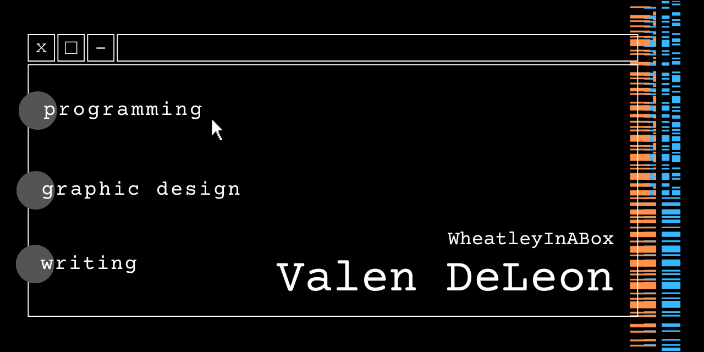

 

<h2>📡 About Me!</h2>

I'm a Bachelor's Computer Science student at CalPoly Pomona and I'm learning and exploring the world of web development!

🫂 Looking for web projects to collaborate on!
     

📨 Need help with internship prospects!
      

📝 Ask me about my writing!
  

<h2>🔗 Links</h2>

  
  

<h2>📦 Tool Box</h2>

Javascript, Typescript
     

HTML, CSS
    

React, Flask, SQLAlchemy
    

C++, C
    

Java, Python

<h2>🌱 Learning</h2>

Frontend & Backend Web Development
     

Figma Design
               

Application Styling (Obsidian)
  

Chrome Extensions

